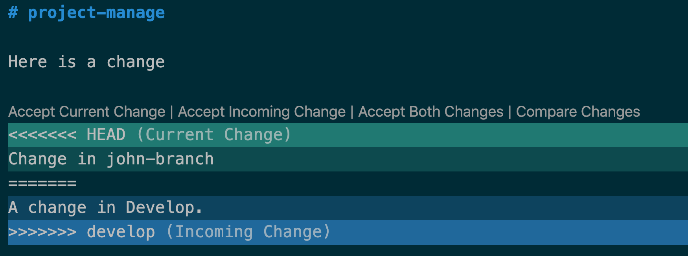

# Git Work Flow

When we share a code base, we are trying to maximize developer productivity and minimize friction. The keys to this are:

- planning
- communication
- incremental change

In practice, we are trying to minimize **code collisions**, i.e., those times where two or more people are making changes to the same document. When we pull our code together, this creates a **merge conflict**. These can be very difficult and frustrating to resolve. Multiple people working on the same files at the same time will create merge conflicts.

## Branch roles

- `main`, aka `master`: this is your stable branch that is used for deployment. Only merge in code that is stable. Code comes into `main` as a result of a pull request (aka, merge request). This is a team decision.
- `develop`: this is the team's sandbox. This is where we merge all of our individiual feature branches together to see if the code works. This should be done as a team or through clear communication.
- **feature branches** (various names): Each feature branch is trying to add new functionality to the `develop` branch. These are meant to be temporary. They should exist as long as it takes to get the feature merged into `develop`. In our projects, it is usually enough to have one feature branch per team member.

## Setting up the repository

1. Create a repository on Github
1. Add a `.gitignore` file to your project
1. Invite all the collaborators
1. Identify who is the project maintainer (traffic cop, enforce best practices)
1. Protect the `main` branch in Github project settings
1. Create a `develop` branch (this can be done in Github as well)
1. Make sure you have settled on your project name
1. Set up deployment to github pages
1. As a team, establish your working file structure

- Project
  - `index.html` (and other html files)
  - `css` folder
    - `style.css` should have common styles, shared by whole app
    - you can have many style sheets. Identify components or pages and styles for those pieces in their own file
  - `js` folder
    - you can have as many js files as you need. Make sure that the files that are dependencies (e.g., jQuery) are loaded first.

This can be done in the Github website, or one person needs to clone the repo, checkout develop set up the file structure and the commit it.

8. Identify who is working on what. Try to establish files

## Setting up your local workspace

1. Clone the project to your machine:

```
git clone git@github.com:username/project-name.git
```

2. Change directory into your project
3. Checkout the remote develop branch

```
git checkout -b develop origin/develop
```

4. Create a feature branch from `develop`

```
git checkout -b myname-branch develop
```

## Coding workflow

1. Make your code changes
2. Commit frequently and often. These changes are still only on your local machine
3. Push your changes. This makes your branch accessible to the team but it is not yet incorporated with other's code

The first time you do this your feature branch is not in Github, so pushing the changes this way will create that for you.

```
git push --set-upstream origin myname-branch
```

From then on you can just add, commit, and push as normal.

## Sharing your code with your team

1. Make a merge request from your branch to `develop`
1. Review the changes, ideally with one or more people (a review step)
1. If good to go, complete the merge request. If not go back and revise
1. Every one on the team should then checkout the `develop` branch
1. Pull the latest code from `develop`. There should be no merge conflicts
1. Merge `develop` into your feature branch

```
git checkout myname-branch
git merge develop
```

This may create a merge conflict. The size and number of conflicts depend on:

- the types of changes in your local feature branch
- the types of changes in the team develop branch

## Resolving merge conflicts

You will know when you have a merge conflict when you see something like this after pulling or merging:


You now have to edit the code to resolve this conflict. This means reviewing your current changes with the incoming changes. VS Code has some useful tools for dealing with this.

1. Click on this icon:  
   
2. Review where the conflicts are:  
   
3. Review each conflict in the editor
   
4. Accept changes or rework what is needed
5. Save files

These changes need to be committed.

```
git add -A
git commit -m "Merging develop into myname-branch"
git push
```

## Deploying

Master branch is protected. At this point you should have a fairly stable develop branch. Make sure that it is as stable as possible. It doesn't have to be complete, just stable.

1. Create a merge request from develop to master
1. Review as a team
1. Execute the merge request

If done right, there should be no merge conflicts.
